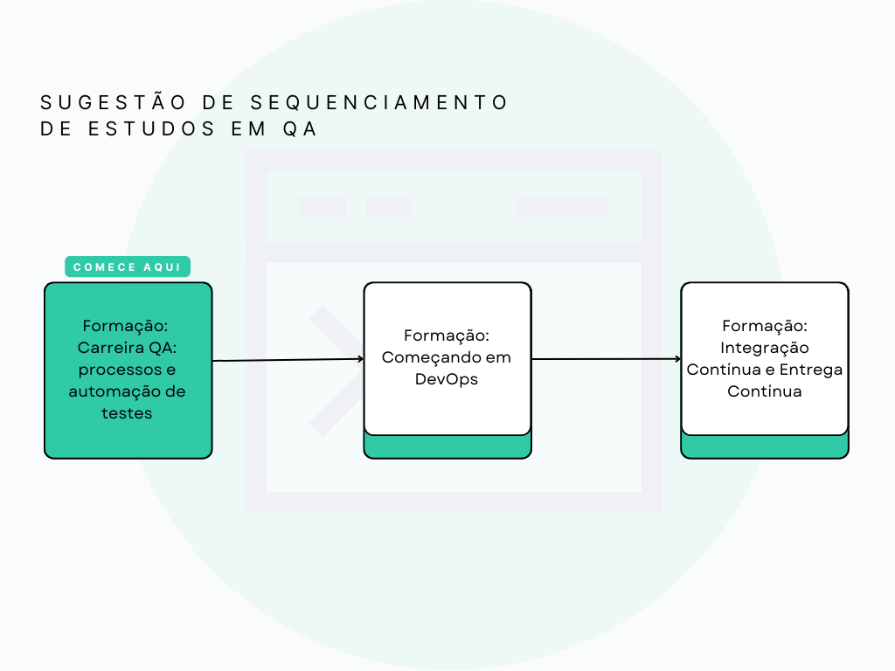

## Início

### Quality Assurance
Testes e cenários de testes
- Modelo de plano de teste
- Fluxo de teste
- Tabela de decisão
- Casos de Teste
- Cenários de Teste
- Casos de Teste

Qualidade
- Qualidade ao longo do ciclo de desenvolvimento
- Critérios de Aceite
- Definição de Pronto
- Qualidade em metodologias ágeis

Tipos de Testes
- Testes relacionados à mudança
- Técnicas de teste
- Testes Não Funcionais
- Testes de Usabilidade
- Testes de Limite
- Testes de Regressão

Pirâmide de Testes
- Testes de Caixa Branca vs testes de Caixa Preta
Evidência de teste
Para saber mais: Ferramenta de gravação de passos
Pirâmide de testes
Faça como eu fiz: Testes na pirâmide
Para saber mais: Pirâmide de testes
Para saber mais: Por que e o que é possível testar?

Gestão de Erros
- Reportando bugs
Classificação de bugs
Custo para a correção de bugs
Faça como eu fiz: Reporte um bug

Estratégia De Teste
- Arquitetura
Escopo do plano de teste
Ambiente e ferramentas
Escopo do plano de teste
Faça como eu fiz: Crie sua estratégia de teste

Refinamentos
- ara saber mais: Ferramentas para QAs
Estimativa de testes
Métrica de qualidade
Métricas de qualidade
Faça como eu fiz: Crie sua estratégia de teste